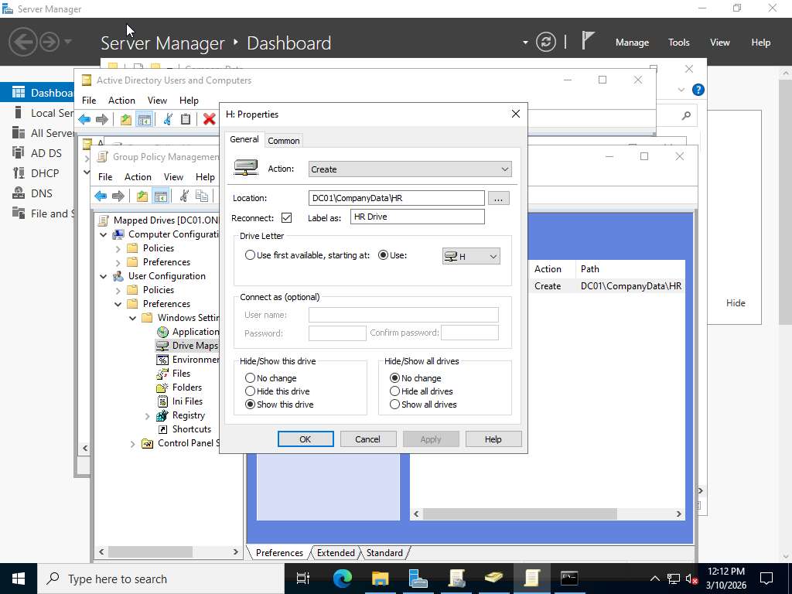
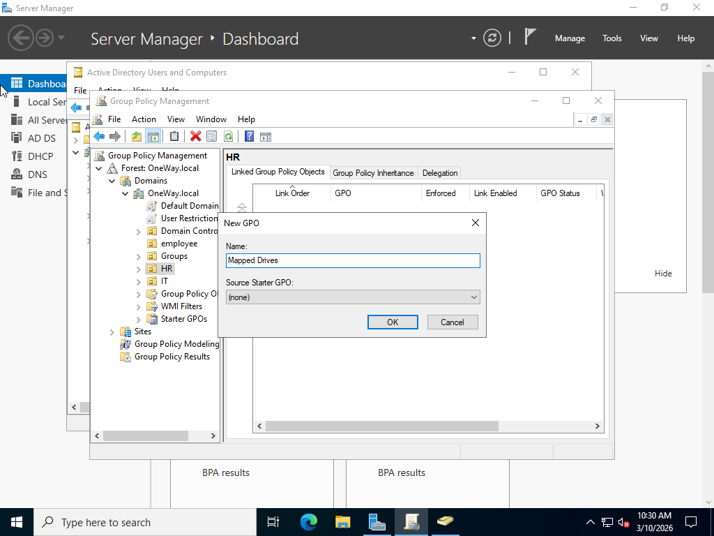
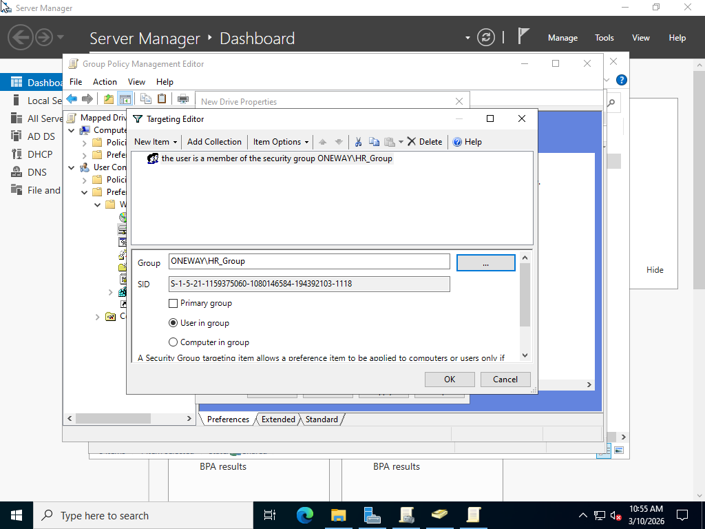
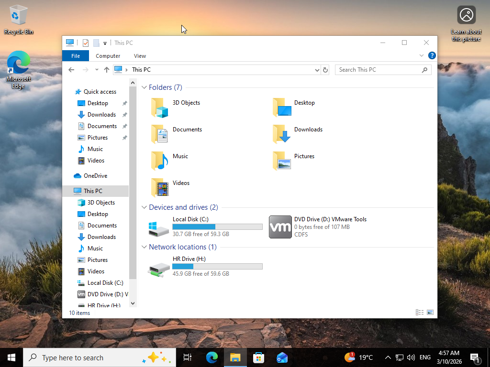

# Active Directory Lab - Day 7
## Drive Mapping using Group Policy

In this lab, I configured automatic network drive mapping using Group Policy in Active Directory.

This allows users to automatically receive the correct network drive based on their department when they log in.

---

## Lab Objectives

- Create a shared folder for the HR department
- Configure NTFS permissions
- Create a Drive Mapping policy
- Apply Group Policy to HR users
- Test the mapped drive from the client machine

---

## Technologies Used

- Windows Server
- Active Directory
- Group Policy Management
- File Server
- Windows Client

---

## Configuration Steps

1. Created HR shared folder on the server
2. Configured NTFS permissions for HR_Group
3. Opened Group Policy Management
4. Created a new GPO for HR users
5. Configured Drive Mapping:
   - Drive Letter: **H**
   - Path: `\\DC01\CompanyData\HR`
6. Applied the GPO to HR OU
7. Ran `gpupdate /force` on client machine
8. Logged in with HR user and verified drive mapping

---

## Screenshots

### Drive Mapping Configuration

### Group Policy Creation

### Item Level Targeting

### HR Shared Folder

